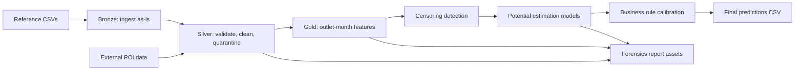

# InsightAI Model Building Plan

## 1. Purpose

This plan defines the step-by-step implementation path for the Data Storm 7.0 InsightAI solution. The goal is to estimate the latent maximum monthly purchase potential, in liters, for each outlet for January 2026.

The competition is not a standard supervised learning problem. There is no direct target label for true potential. Historical sales are treated as censored observations:

```text
Observed Sales = min(True Consumer Demand, Business/System Constraint)
```

The solution must therefore combine data engineering, data forensics, geospatial enrichment, business logic, and defensible statistical modeling.

## 2. Repository Structure To Preserve

Do not restructure the repository. Implement within the current layout:

```text
Data-Storm-7.0-InsightAI/
├── config/
│   └── pipeline_config.yaml
├── data/
│   ├── bronze/
│   ├── silver/
│   │   └── rejected/
│   └── gold/
├── Refernce Resources/
├── src/
│   ├── bronze/
│   ├── silver/
│   ├── gold/
│   ├── modeling/
│   └── utils/
├── notebooks/
├── experiments/
├── ai_log/
├── logs/
├── output/
├── run_pipeline.py
└── README.md
```

Current raw reference files:

- `transactions_history_final.csv`
- `outlet_master.csv`
- `outlet_coordinates.csv`
- `distributor_seasonality_details.csv`
- `holiday_list.csv`
- `1. dataset_description.xlsx`
- `Data Storm 7.0 - Storming Round Problem.pdf`
- `PROBLEM_REFERENCE.md`

## 3. End-To-End Pipeline View



## 4. Implementation Phases

### Phase 0: Governance And Setup

Owner goal: make the pipeline reproducible before doing modeling.

Checklist:

- [x] Confirm all source CSVs exist in `Refernce Resources/`.
- [x] Confirm `transactions_history_final.csv` is ignored by Git if larger than GitHub limits.
- [x] Run `python3 run_pipeline.py --stage bronze`.
- [x] Verify bronze outputs are written to paths in `config/pipeline_config.yaml`.
- [x] Add every major prompt or AI-assisted decision to `ai_log/genai_transparency_log.md`.
- [x] Start a new entry in `experiments/experiment_log.md`.
- [x] Confirm logs are written to `logs/pipeline.log`.

Manual decision points:

- [x] Decide whether bronze should store only Parquet outputs or both raw CSV copies and Parquet.
- [x] Decide if all generated datasets should be reproducible and ignored by Git.
- [x] Freeze a single project config file as the source of truth.

Deliverables:

- [x] Clean runnable project setup.
- [x] Updated GenAI transparency log.
- [x] Updated experiment log.

Phase 0 completion notes:

- Completed on 2026-05-15.
- Raw data source remains `Refernce Resources/` as configured in `config/pipeline_config.yaml`.
- `transactions_history_final.csv` is available locally in `Refernce Resources/` and ignored by Git because it is larger than GitHub's 100 MB file limit.
- Bronze stage was executed with `python3 run_pipeline.py --stage bronze`.
- Bronze outputs generated:
  - `data/bronze/transactions_history.parquet`: 2,376,389 rows x 7 columns.
  - `data/bronze/outlet_master.parquet`: 20,000 rows x 4 columns.
  - `data/bronze/outlet_coordinates.parquet`: 20,000 rows x 3 columns.
  - `data/bronze/distributor_seasonality.parquet`: 360 rows x 4 columns.
  - `data/bronze/holiday_list.parquet`: 349 rows x 3 columns.
- Generated Parquet files and runtime logs remain ignored/reproducible.
- Manual decision: keep raw CSV files as the read-only source in `Refernce Resources/`, and use Bronze Parquet files as the reproducible pipeline interface.

## 5. Bronze Layer Plan

Bronze must preserve source data without business transformations.

Relevant files:

- `src/bronze/ingest_internal.py`
- `src/bronze/ingest_poi.py`
- `src/utils/io.py`
- `config/pipeline_config.yaml`

Checklist:

- [ ] Read all raw CSVs from `Refernce Resources/`.
- [ ] Save each dataset to `data/bronze/*.parquet`.
- [ ] Preserve original column names.
- [ ] Preserve row counts.
- [ ] Add ingestion metadata: source file, load timestamp, row count, column count.
- [ ] Log file sizes and schema summaries.
- [ ] Fail fast if required files are missing.

Required row-count validation:

- [ ] `transactions_history_final.csv`: about 2,376,389 rows.
- [ ] `outlet_master.csv`: 20,000 rows.
- [ ] `outlet_coordinates.csv`: 20,000 rows.
- [ ] `distributor_seasonality_details.csv`: 360 rows.
- [ ] `holiday_list.csv`: 349 rows.

Recommended visual checks:

- Bar chart: row count by dataset.
- Table: expected vs actual row counts.
- Table: inferred schema by dataset.

Manual decision points:

- [ ] If row counts differ from reference notes, stop and investigate before cleaning.
- [ ] If column names differ from config, update config or ingestion mapping, not downstream code.

## 6. Silver Layer Plan

Silver is the main competition scoring area. It must show strong data forensics, reusable DQ checks, and quarantining.

Relevant files:

- `src/silver/dq_checks.py`
- `src/silver/quarantine.py`
- `src/silver/clean_transactions.py`
- `src/silver/clean_outlet_master.py`
- `src/silver/clean_coordinates.py`
- `src/silver/clean_seasonality.py`
- `src/silver/clean_holidays.py`
- `src/silver/clean_poi.py`

### 6.1 Reusable DQ Framework

Implement or verify these checks are parameterized:

- [ ] Duplicate check by configurable key.
- [ ] Mandatory null check.
- [ ] Type and format check.
- [ ] Numeric range check.
- [ ] Referential integrity check.
- [ ] Allowed category check.
- [ ] Outlier flagging check.
- [ ] Date coverage check.
- [ ] Coordinate bounding-box check.

Every rejected record should include:

- `source_dataset`
- `check_name`
- `failure_reason`
- `severity`
- `detected_at`
- original columns

Manual severity rules:

- `CRITICAL`: cannot be used downstream.
- `WARNING`: usable but flagged.
- `INFO`: tracked anomaly, no removal.

### 6.2 Transaction Cleaning

Input: `data/bronze/transactions_history.parquet`

Known issues:

- Negative volumes and bill values.
- Zero-volume rows.
- Extreme transaction outliers.
- No `Product_Name` despite the reference description.

Checklist:

- [ ] Validate mandatory columns.
- [ ] Validate year range: 2023 to 2025.
- [ ] Validate month range: 1 to 12.
- [ ] Validate SKU format: `SKU_01` to `SKU_10`.
- [ ] Validate distributor IDs against seasonality file.
- [ ] Validate outlet IDs against outlet master.
- [ ] Tag negative rows as likely returns/reversals.
- [ ] Tag zero-volume rows as likely system adjustments.
- [ ] Flag extreme values using distributor/outlet/SKU-level robust statistics.
- [ ] Aggregate transactions to outlet-month and outlet-SKU-month summaries.
- [ ] Keep gross volume, return volume, net volume, bill value, transaction count.

Recommended visualizations:

- Histogram: `Volume_Liters`, raw and log-scaled.
- Boxplot: monthly volume by outlet size.
- Heatmap: year-month transaction count.
- Line chart: total monthly liters by distributor.
- Scatter plot: `Volume_Liters` vs `Total_Bill_Value`.
- Pareto chart: top SKUs by volume.
- Outlier table: largest positive and negative volume transactions.

Manual decision points:

- [ ] Decide whether negative records reduce net sales or are quarantined from potential modeling.
- [ ] Decide outlier treatment: retain, cap, quarantine, or flag only.
- [ ] Decide aggregation level for modeling: outlet-month total vs outlet-SKU-month.

### 6.3 Outlet Master Cleaning

Input: `data/bronze/outlet_master.parquet`

Known issues:

- `Outlet_Size` case inconsistency.
- Null `Outlet_Size`.
- Typo categories: `Grocry`, `Bakry`, and spaced ` Eatery `.

Checklist:

- [ ] Trim whitespace in text columns.
- [ ] Standardize outlet type names.
- [ ] Standardize outlet size names.
- [ ] Keep missing outlet size as `Unknown` or impute, with a flag.
- [ ] Validate `Cooler_Count` range.
- [ ] Validate one row per `Outlet_ID`.

Recommended visualizations:

- Bar chart: outlet count by type before and after cleaning.
- Bar chart: outlet count by size before and after cleaning.
- Stacked bar: outlet size by outlet type.
- Histogram: cooler count distribution.

Manual decision points:

- [ ] Decide whether missing `Outlet_Size` should be imputed from outlet type and volume peers.
- [ ] Decide whether `Cooler_Count = 0` means true no-cooler or unknown capacity.

### 6.4 Coordinate Cleaning

Input: `data/bronze/outlet_coordinates.parquet`

Checklist:

- [ ] Validate one coordinate row per outlet.
- [ ] Validate latitudes and longitudes are inside Sri Lanka bounds.
- [ ] Validate all coordinates join to outlet master.
- [ ] Flag duplicated coordinates.
- [ ] Create geohash or rounded coordinate bucket for spatial grouping.

Recommended visualizations:

- Map scatter: all outlet coordinates.
- Heatmap: outlet density by province/distributor proxy.
- Table: duplicated coordinates and outlet counts per coordinate.

Manual decision points:

- [ ] Decide how to treat duplicated coordinates: co-located outlets vs GPS defaulting.
- [ ] Decide whether to cluster coordinates spatially for catchment features.

### 6.5 Seasonality Cleaning

Input: `data/bronze/distributor_seasonality.parquet`

Checklist:

- [ ] Validate 10 distributors x 36 months = 360 rows.
- [ ] Validate seasonality values: `Favorable`, `Moderate`, `Un-Favorable`.
- [ ] Encode seasonality as ordinal or one-hot features.
- [ ] Validate every transaction distributor-month has seasonality.

Recommended visualizations:

- Heatmap: distributor vs month seasonality.
- Bar chart: seasonality counts by distributor.

Manual decision points:

- [ ] Decide encoding: ordinal score, one-hot, or target effect.
- [ ] Decide January 2026 seasonality assumption from historical January patterns.

### 6.6 Holiday Cleaning

Input: `data/bronze/holiday_list.parquet`

Checklist:

- [ ] Parse ISO date strings to date.
- [ ] Extract year, month, day.
- [ ] Handle multiple holidays on the same date.
- [ ] Create monthly holiday counts by type.
- [ ] Create January holiday features for 2026 if known or proxy from historical January.

Recommended visualizations:

- Calendar heatmap: holidays by month.
- Bar chart: holiday type counts.
- Line chart: monthly holiday counts by year.

Manual decision points:

- [ ] Decide whether holiday count affects sales positively, negatively, or both depending on outlet type.
- [ ] Decide whether Poya/Public/Bank/Mercantile holidays need separate coefficients.

## 7. External POI Enrichment Plan

The competition requires external POI acquisition. Use OpenStreetMap/Overpass or other public sources.

Relevant files:

- `src/bronze/ingest_poi.py`
- `src/silver/clean_poi.py`
- `src/gold/feature_poi.py`

Target POI categories from config:

- Schools
- Hospitals
- Bus stops
- Places of worship
- Restaurants
- Banks
- Supermarkets
- Fuel stations

Implementation checklist:

- [ ] Sample a small batch of outlets first.
- [ ] Query Overpass API using radius from `pipeline_config.yaml`.
- [ ] Cache raw API responses in `data/bronze/poi_raw/`.
- [ ] Apply rate limiting.
- [ ] Normalize POI category labels.
- [ ] Deduplicate POIs by OSM ID or coordinate/category.
- [ ] Create features: count within radius, nearest distance, category density.
- [ ] Write cleaned POI data to `data/silver/poi_clean.parquet`.

Recommended visualizations:

- Map: outlets with POI density overlay.
- Bar chart: average POI count by outlet type.
- Scatter plot: outlet monthly volume vs total POI count.
- Boxplot: volume by POI density quartile.

Manual decision points:

- [ ] Decide search radius: 250m, 500m, 1km, or multiple rings.
- [ ] Decide whether each POI type should have equal weight.
- [ ] Decide whether urban outlets require different POI interpretation than rural outlets.

## 8. Gold Feature Engineering Plan

Gold converts cleaned datasets into a model-ready outlet-level table for January 2026.

Relevant files:

- `src/gold/feature_transaction.py`
- `src/gold/feature_outlet_profile.py`
- `src/gold/feature_seasonality.py`
- `src/gold/feature_censoring.py`
- `src/gold/feature_poi.py`
- `src/gold/build_model_input.py`

### 8.1 Transaction Features

Checklist:

- [ ] Monthly total liters per outlet.
- [ ] Monthly total bill value per outlet.
- [ ] Average price per liter.
- [ ] SKU diversity per outlet.
- [ ] Active months count.
- [ ] Recency: months since last sale.
- [ ] Rolling 3-month average volume.
- [ ] Rolling 6-month average volume.
- [ ] Rolling 12-month average volume.
- [ ] Year-over-year January growth.
- [ ] Peak month volume.
- [ ] 75th/90th/95th percentile monthly volume.
- [ ] Coefficient of variation.
- [ ] Return ratio.
- [ ] Zero-volume ratio.

### 8.2 Outlet Profile Features

Checklist:

- [ ] One-hot outlet type.
- [ ] Ordered outlet size score.
- [ ] Cooler count.
- [ ] Cooler capacity proxy.
- [ ] Peer group key: outlet type + outlet size + distributor.

### 8.3 Location And POI Features

Checklist:

- [ ] Latitude and longitude.
- [ ] Spatial cluster ID.
- [ ] POI counts by category.
- [ ] Total POI count.
- [ ] Nearest bus stop distance.
- [ ] Nearest school/hospital/supermarket distance.
- [ ] POI weighted demand score.

### 8.4 Seasonality And Holiday Features

Checklist:

- [ ] Distributor January seasonality score.
- [ ] Historical January volume ratio by distributor.
- [ ] Monthly holiday count by type.
- [ ] Public holiday count.
- [ ] Poya day count.

### 8.5 Censoring Features

Checklist:

- [ ] Plateau flag: same/similar volume for consecutive months.
- [ ] Low coefficient of variation flag.
- [ ] High POI but low sales mismatch flag.
- [ ] Low cooler count but high peer potential flag.
- [ ] Frequent returns flag.
- [ ] Missed-month gaps flag.
- [ ] Stockout proxy: sudden zero after high-volume period.

Recommended visualizations:

- Correlation heatmap of model features.
- Pairplot/sample scatter matrix of key numeric features.
- Feature missingness heatmap.
- Spatial cluster volume map.
- Censoring flag rate by outlet type and distributor.

Manual decision points:

- [ ] Decide final feature list after checking leakage and redundancy.
- [ ] Decide whether to include historical December 2025 directly for January 2026 prediction.
- [ ] Decide whether to normalize features globally or within peer groups.

## 9. Modeling Strategy

Because true potential is unobserved, use a layered modeling strategy rather than a single black-box model.

### 9.1 Baseline Models

Checklist:

- [ ] Baseline 1: recent 3-month average adjusted by January seasonality.
- [ ] Baseline 2: historical January average by outlet.
- [ ] Baseline 3: peer-group 90th percentile by outlet type, size, distributor.
- [ ] Baseline 4: max historical monthly sales with smoothing.

Manual decision points:

- [ ] Select a conservative minimum prediction rule: potential should usually be >= stable observed sales.
- [ ] Decide how much uplift is allowed above observed max.

### 9.2 Censoring-Aware Models

Recommended methods:

- Quantile regression for upper-demand estimate.
- Peer percentile uplift model.
- Gradient boosting regressor trained on proxy targets.
- Tobit-style or censored regression if implementation time allows.
- Ensemble combining statistical and business-rule estimates.

Proxy targets to test:

- Outlet historical 90th percentile monthly volume.
- Outlet historical max monthly volume.
- Peer-adjusted upper percentile potential.
- January-specific seasonality-adjusted max.

Checklist:

- [ ] Build training table at outlet-month level for 2023-2025.
- [ ] Use temporal validation: train through Nov 2025, validate Dec 2025 or hold out selected months.
- [ ] Compare models against baselines.
- [ ] Generate outlet-level January 2026 predictions.
- [ ] Apply post-model calibration.

### 9.3 Ensemble Logic

Suggested formula:

```text
Potential =
  max(
    recent_sales_floor,
    weighted_average(
      quantile_model_prediction,
      peer_group_ceiling,
      historical_peak_adjusted,
      POI_demand_adjusted_estimate
    )
  )
```

Post-processing checklist:

- [ ] Enforce non-negative predictions.
- [ ] Enforce potential not below recent stable observed sales.
- [ ] Cap unrealistic predictions using peer group upper bounds.
- [ ] Increase potential for high-POI, low-sales, likely constrained outlets.
- [ ] Reduce extreme outputs for low-POI, low-cooler, low-history outlets.

Manual decision points:

- [ ] Choose ensemble weights based on validation, business logic, and explainability.
- [ ] Decide peer-group cap percentile: 95th, 97.5th, or 99th.
- [ ] Decide minimum uplift for likely censored outlets.

## 10. Validation And Evaluation Plan

There is no true target, so validate by consistency, robustness, and business sense.

Checklist:

- [ ] Backtest January 2025 using data up to Dec 2024.
- [ ] Backtest December 2025 using data up to Nov 2025.
- [ ] Compare predicted potential vs actual observed sales.
- [ ] Check that predictions are generally above observed sales ceilings.
- [ ] Check ranking stability across model variants.
- [ ] Review top 100 and bottom 100 outlets manually.
- [ ] Review prediction distribution by outlet type, size, distributor, and region.
- [ ] Review high uplift cases for plausible POI/censoring explanation.

Recommended metrics:

- MAE/RMSE against observed sales for backtest, interpreted carefully.
- Spearman rank correlation against observed future sales.
- Coverage: percent predictions >= observed future sales.
- Uplift ratio distribution.
- Peer percentile consistency.

Recommended visualizations:

- Histogram: final `Maximum_Monthly_Liters`.
- Boxplot: prediction by outlet type.
- Boxplot: prediction by outlet size.
- Scatter: observed recent max vs predicted potential.
- Scatter: POI demand score vs predicted uplift.
- Heatmap: average prediction by distributor and outlet type.
- Map: predicted potential by outlet location.
- Waterfall chart: baseline to final potential uplift components.

Manual decision points:

- [ ] Decide if prediction distribution is too conservative or too aggressive.
- [ ] Decide if certain outlet types need business-rule overrides.
- [ ] Decide whether outlier predictions require manual review flags.

## 11. Report And Storytelling Plan

The final report is capped at 5 pages, so every chart must support the methodology.

Recommended report structure:

1. Problem framing: observed sales are censored, potential is latent.
2. Data forensics: raw anomalies, DQ checks, quarantine design.
3. POI acquisition: source, categories, radius, features.
4. Modeling logic: baseline, censoring detection, quantile/peer uplift, ensemble.
5. Results and explainability: prediction distribution, example outlet cases, GenAI usage.

Must-have report visuals:

- Medallion pipeline diagram.
- Data quality anomaly summary chart.
- POI feature map or density example.
- Censoring logic diagram.
- Prediction distribution by outlet type/size.

Manual decision points:

- [ ] Select only 4-6 strong visuals for final report.
- [ ] Include one or two outlet-level case studies explaining uplift.
- [ ] Avoid overclaiming accuracy because true potential has no ground truth.

## 12. Initial Implementation Order

Follow this order for fastest progress.

### Sprint 1: Make Pipeline Fully Runnable

- [x] Confirm `run_pipeline.py --stage bronze` works.
- [x] Wire `run_pipeline.py --stage silver` to all silver cleaning modules.
- [x] Wire `run_pipeline.py --stage gold` to all gold feature modules.
- [x] Wire `run_pipeline.py --stage predict` to modeling and output generation.
- [x] Ensure every stage logs start, finish, row counts, and output paths.

### Sprint 2: Build Silver Forensics

- [x] Complete reusable DQ functions.
- [x] Implement transaction anomaly tagging.
- [x] Implement outlet master cleaning.
- [x] Implement coordinates validation.
- [x] Implement seasonality and holiday cleaning.
- [x] Write rejection manifest.

### Sprint 3: Build Gold Features

- [x] Build outlet-month transaction features.
- [x] Build outlet profile features.
- [x] Build seasonality and holiday features.
- [x] Build censoring features.
- [x] Add POI features after external collection.
- [x] Produce `data/gold/model_input.parquet`.

### Sprint 4: Build Models

- [x] Build baselines.
- [x] Build quantile/peer ceiling models.
- [x] Build censoring uplift logic.
- [x] Build ensemble.
- [x] Produce `output/insightai_predictions.csv`.

### Sprint 5: Validate And Package

- [x] Run backtests.
- [x] Generate final charts.
- [x] Update README run instructions if needed.
- [x] Update GenAI transparency log.
- [ ] Prepare final report.
- [ ] Zip or publish reproducible repo.

## 13. Final Delivery Checklist

Engineering:

- [ ] Bronze, Silver, Gold stages are runnable.
- [ ] Generated files follow `config/pipeline_config.yaml`.
- [ ] Rejected records include reasons.
- [ ] No silent dropping of records.
- [ ] Logs are generated.
- [ ] README has clear run steps.

Data:

- [ ] All raw datasets are accounted for.
- [ ] Silver datasets have row-count reconciliation.
- [ ] Gold model input has one row per outlet for final prediction.
- [ ] Missing values are documented.
- [ ] Outliers are flagged or justified.

Model:

- [ ] Baselines are implemented.
- [ ] Censoring detection is implemented.
- [ ] Final model has business-rule safeguards.
- [ ] Prediction file has required columns:
  - `Outlet_ID`
  - `Maximum_Monthly_Liters`
- [ ] Predictions cover all target outlets.
- [ ] Predictions are non-negative and plausible.

Visualization:

- [ ] Data quality summary chart.
- [ ] Sales trend chart.
- [ ] Outlier chart.
- [ ] POI density chart/map.
- [ ] Censoring flag distribution.
- [ ] Prediction distribution.
- [ ] Manual review table for highest uplift outlets.

Documentation:

- [ ] `ai_log/genai_transparency_log.md` is complete.
- [ ] `experiments/experiment_log.md` records model experiments.
- [ ] Final report is concise and under 5 pages.
- [ ] Limitations are stated honestly.

## 14. Manual Review Gates

Use these review gates to avoid building a technically correct but business-weak model.

Gate 1: Data sanity

- [ ] Do row counts match expectations?
- [ ] Are known planted issues captured?
- [ ] Are rejected records explainable?

Gate 2: Feature sanity

- [ ] Do features have expected ranges?
- [ ] Are POI and geospatial features plausible?
- [ ] Are high-volume outlets distinguishable from low-volume outlets?

Gate 3: Model sanity

- [ ] Are predicted potentials usually above stable observed sales?
- [ ] Are top predictions believable for outlet type, size, cooler count, and location?
- [ ] Are low predictions explainable?

Gate 4: Business sanity

- [ ] Would a sales manager trust the ranking?
- [ ] Can we explain why an outlet deserves cooler/trade spend?
- [ ] Are constrained outlets surfaced clearly?

## 15. Risks And Mitigations

| Risk | Impact | Mitigation |
|---|---|---|
| No true target variable | Cannot optimize normal supervised metric | Use proxy targets, backtesting, ranking checks, and explainable uplift logic |
| Large transaction file | Slow pipeline | Store Parquet in bronze, aggregate early in silver/gold |
| POI API rate limits | Incomplete enrichment | Cache responses, batch requests, use smaller pilot area first |
| Dirty master data | Bad joins and wrong peer groups | Strong DQ checks and quarantine manifest |
| Over-aggressive potential estimates | Business implausibility | Peer caps, manual review tables, conservative floors |
| Over-conservative estimates | Missed hidden potential | Censoring flags and POI-driven uplift |

## 16. Success Definition

The final solution is successful if it:

- Preserves raw data in Bronze.
- Produces cleaned, validated Silver data with rejected records.
- Produces explainable Gold features.
- Acquires and uses external POI signals.
- Handles censored demand explicitly.
- Generates a complete prediction file for January 2026.
- Provides a defensible story for judges focused on data forensics, methodology, and GenAI workflow.
